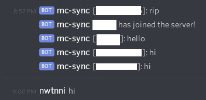

# mc-suite

This repo contains two Discord bots that manage a Minecraft server hosted on AWS EC2.
`mc-boot` starts and hibernates the EC2 instance when it detects users in the voice
channel, and `mc-sync` synchronizes chat across Discord and Minecraft. We also use
[marco](https://github.com/nwtnni/marco) as basic dynamic DNS for the EC2 instance
(which changes public IP addresses across restarts), as a free alternative to Amazon's
[Elastic IP](https://docs.aws.amazon.com/AWSEC2/latest/UserGuide/elastic-ip-addresses-eip.html).

Neither bots are publically available, because they're not very robust to failures (for
example, if someone leaves the voice channel but stays on the Minecraft server while
it enters hibernation, what happens when the instance restarts?). But you're free to
clone or fork this repository and run your own bots!

## mc-boot

This Discord bot detects when users join or leave voice channels. It announces that
the server is starting or stopping on Discord, and uses [rusoto_ec2](https://docs.rs/rusoto_ec2/0.46.0/rusoto_ec2/index.html)
to interface with the EC2 API.

### Usage

Requires the following environment variables:

- `DISCORD_TOKEN`: this bot's application token.
- `DISCORD_GENERAL_CHANNEL_ID`: channel to send server status updates.
- `AWS_ACCESS_KEY_ID` and `AWS_SECRET_ACCESS_KEY`: [AWS credentials](https://docs.aws.amazon.com/general/latest/gr/aws-access-keys-best-practices.html).
- `AWS_INSTANCE_ID`: EC2 instance the server runs on.

## mc-sync

This Discord bot wraps around a Minecraft server process in order to integrate with a Discord server.

There are three concurrent tasks:

- Read commands from stdin and forward them to the inner Minecraft server's stdin.

- Read output from the inner server's stdout, parse them for interesting
  events (e.g. players logging in or achievements), and send them to Discord.

- Listen to messages from Discord and broadcast them within
  Minecraft by writing a `/say` command to the inner Minecraft server.

Currently the bot also provides an `!online` command for listing the players currently logged into
the server.

### Usage

Requires the following environment variables:

- `DISCORD_TOKEN` this bot's application token.
- `DISCORD_GENERAL_CHANNEL_ID` channel to forward interesting server events.
- `DISCORD_VERBOSE_CHANNEL_ID` channel to forward all server logs.

Run the bot with the server command as its first argument. For example,

```bash
#!/bin/sh
# start.sh

java -Xmx3024M -Xms3024M -jar server.jar nogui
```

This may differ depending on your directory structure:

```bash
> cargo build --release
> ./target/release/mc-sync "../server/start.sh"
```

### Screenshot


